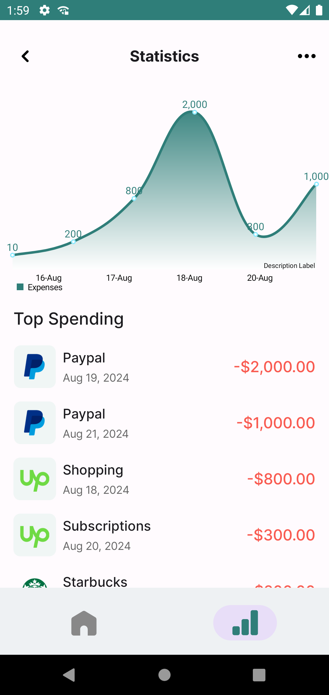

# Simple Bank - My Expense Tracker

## Overview
The **Simple Bank - My Expense Tracker** is a powerful tool to help users manage their daily expenses effectively. With features like adding, viewing, and analyzing expenses through intuitive stats and charts, this app simplifies personal finance management. 

It is built using modern Android development practices to deliver a robust and scalable solution.

---

## Features
- **Add Expense**: Quickly add daily expenses by inputting the amount, category, and optional notes.
- **Track Expenses**: View a categorized and date-wise list of all expenses.
- **Analyze Spending**: Gain insights into your spending habits with detailed stats and interactive charts.

---

## Technologies Used

### Android Framework
- **Jetpack Compose**: A modern toolkit for building native Android UI with declarative components.
- **Room Database**: A database layer on top of SQLite for managing local data efficiently.
- **Dagger Hilt**: A dependency injection library to simplify and optimize app architecture.
- **MVVM Architecture**: Ensures separation of UI, business logic, and data handling for maintainability and scalability.

---

## Screenshots
Take a look at the app's key screens:

| **Home Screen**       | **Add Expense**       | **Stats and Charts** |
|------------------------|-----------------------|-----------------------|
|      |      |     |

---

## Getting Started

### Prerequisites
Before you begin, ensure you have the following:
- **Android Studio Bumblebee** or later
- **Java 11** or later
- **Android SDK 21** or above

### Installation
1. Clone the repository:
   ```bash
   git clone https://github.com/yourusername/SimpleBankExpenseTracker.git
   ```
2. Open the project in **Android Studio**.
3. Sync the Gradle files to fetch dependencies.
4. Build and run the app on an emulator or physical Android device.

---

## Usage

### Adding an Expense
- Tap the **Add Expense** button.
- Enter the amount, select a category, and optionally add notes.
- Save the expense to track it.

### Viewing Expenses
- Navigate to the **Expense List** screen.
- View all recorded expenses organized by date and category.
- Tap on an expense to edit or delete it.

### Analyzing Expenses
- Open the **Stats** section to view summaries of your spending habits.
- Analyze interactive charts to identify trends and manage finances better.

---

## Contributing
We welcome contributions! To get started:
1. Fork the repository.
2. Create a new branch for your feature (`git checkout -b feature-name`).
3. Commit your changes (`git commit -m "Add new feature"`).
4. Push to the branch (`git push origin feature-name`).
5. Open a pull request for review.

---

